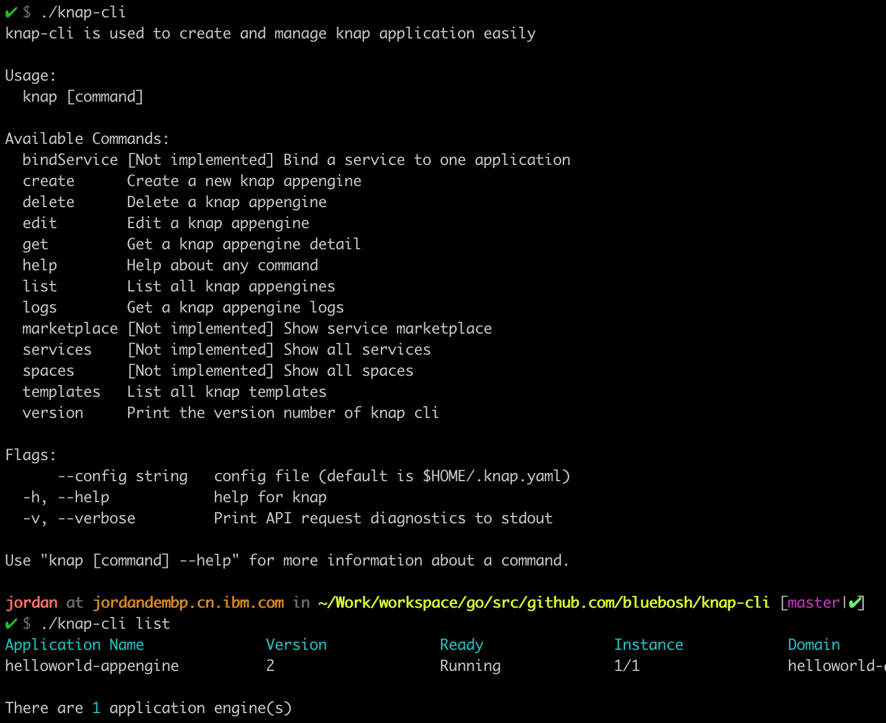

# knap-cli

This is the repo for knap command line:



## Command Overview
```$xslt
✔ $ ./knap-cli
knap-cli is used to create and manage knap application easily

Usage:
  knap [command]

Available Commands:
  bindService [Not implemented] Bind a service to one application
  create      Create a new knap appengine
  delete      Delete a knap appengine
  edit        Edit a knap appengine
  get         Get a knap appengine detail
  help        Help about any command
  list        List all knap appengines
  logs        Get a knap appengine logs
  marketplace [Not implemented] Show service marketplace
  services    [Not implemented] Show all services
  spaces      [Not implemented] Show all spaces
  templates   List all knap templates
  version     Print the version number of knap cli

Flags:
      --config string   config file (default is $HOME/.knap.yaml)
  -h, --help            help for knap
  -v, --verbose         Print API request diagnostics to stdout

Use "knap [command] --help" for more information about a command.
```

## Create a new application
```$xslt
✘-1 $ ./knap-cli create helloworld -r https://github.com/bluebosh/knap-example -v master -s 2 -t build-and-deploy-pipeline
Application engine helloworld is created successfully
```

## List all applications
```$xslt
✔ $ ./knap-cli list
Application Name              Version             Ready               Instance            Domain
helloworld-appengine          1                   Running             1/2                 helloworld-default.knativepipeline.us-south.containers.appdomain.cloud
picalc-appengine              1                   Running             1/1                 picalc-default.knativepipeline.us-south.containers.appdomain.cloud

There are 2 application engine(s)
```

## Get an application
```$xslt
✔ $ ./knap-cli get helloworld-appengine
Application Name:              helloworld-appengine
Application Version:           1
Application Git Repo:          https://github.com/bluebosh/knap-example
Application Git Revision:      master
Application Template:          build-and-deploy-pipeline
Application Ready:             Running
Application Status:            Succeeded
Application Instance:          1
Application Size:              2
Application Domain:            https://helloworld-default.knativepipeline.us-south.containers.appdomain.cloud
```

## Show all application templates
```$xslt
✔ $ ./knap-cli templates
Template Name                           Template Flow
build-and-deploy-pipeline               source-to-image -> deploy-to-cluster
build-and-deploy-test-pipeline          source-to-image -> deploy-to-cluster -> test-on-cluster
more-complex-pipeline                   source-to-image -> deploy-to-cluster -> blue-green-upgrade

There are 3 template(s)
```